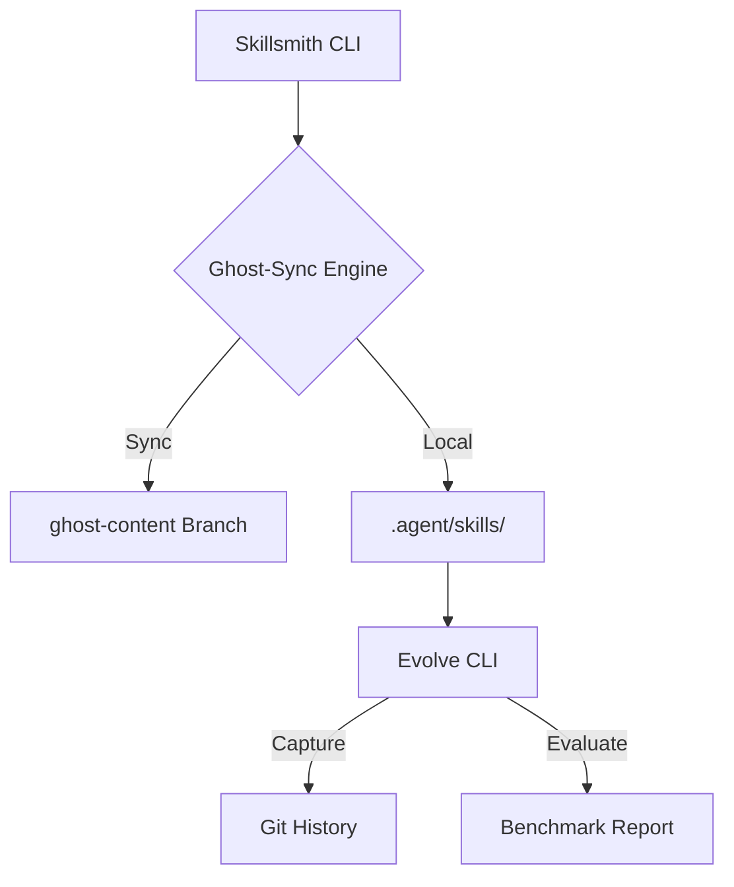

# PROJECT.md / Skillsmith

## 1. Overview
Skillsmith is a high-velocity, sovereign Agentic Operating System. It decouples core CLI logic from an expert intelligence layer (882+ skills), enabling zero-dependency distribution and autonomous evolution.

## 2. Strategic Vision ($100M Moat)
- **Architectural Sovereignty**: No dependency on external registries or Node/NPX. The ecosystem is 100% Python-native and repo-agnostic.
- **Deep Intelligence**: 882+ specialized skills managed via the `ghost-content` branch.
- **Recursive Evolution**: Autonomous capture (`capture`), discovery (`unlabeled`), and benchmarking (`evaluate`).

## 3. Tech Stack
- **Core**: Python 3.10+
- **CLI**: Click
- **Styling**: Rich / Console UI
- **Sync Engine**: Ghost-Sync (Native Requests/Zip streaming)
- **Benchmarking**: Evolve Evaluator (AgentSkills.io standard)

## 4. Architecture: Ghost-Sync Network

## 5. Non-Functional Requirements (NFR)
- **Performance**: Initialization must be < 2 seconds (assuming cached ghost).
- **Security**: No secrets in the Ghost Branch. Optional GPG signature verification for sync.
- **Portability**: Must run in any standard Python environment without binary dependencies.

## 6. Dependencies
- `requests`: Network sync.
- `pyyaml`: Metadata parsing.
- `rich`: Visual telemetry.
- `click`: Interface grammar.
